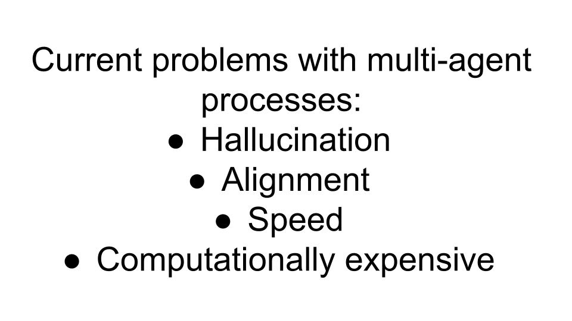

# AI Agent Search

This project implements an AI agent capable of performing searches.

## Setup

1.  **Create a virtual environment:**
    ```bash
    python3 -m venv venv
    source venv/bin/activate
    ```
    *Note: On Windows, use `venv\Scripts\activate`*

2.  **Navigate to the agent directory:**
    ```bash
    cd agent
    ```

3.  **Install dependencies (within the `agent` directory):**
    ```bash
    pip install -r requirements.txt
    ```

4.  **Set up API Keys (within the `agent` directory):**
    Export the following environment variables with your API keys:
    ```bash
    export OPENAI_API_KEY='your_openai_api_key'
    export GEMINI_API_KEY='your_gemini_api_key'
    export EXA_API_KEY='your_exa_api_key'
    ```
    Replace `'your_...'` with your actual keys.

## Running the Agent

Execute the main agent script (ensure you are in the `agent` directory):

```bash
python experiment.py
```

## Demo




(sorry I meant for trivial tasks)
